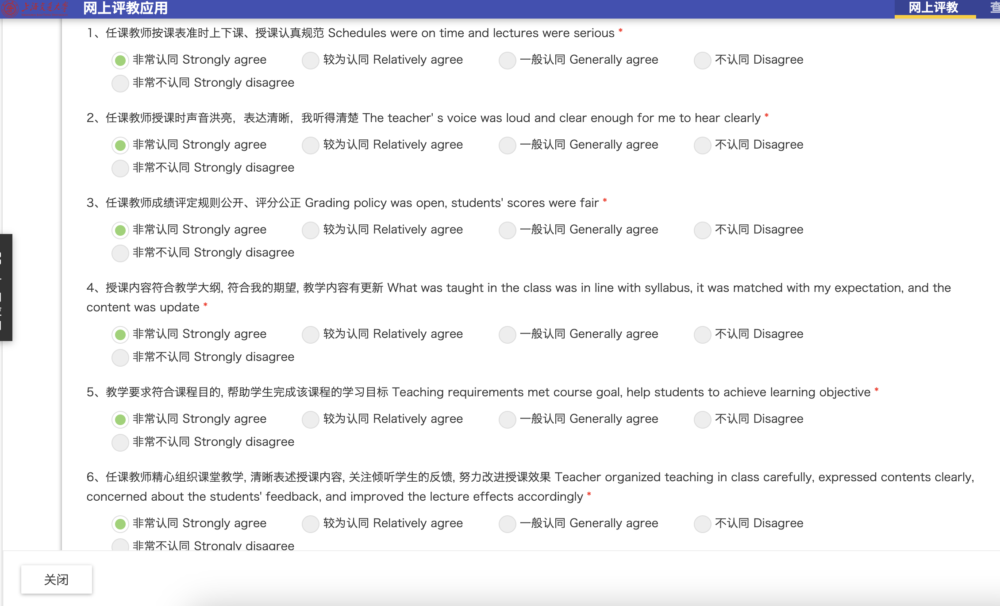
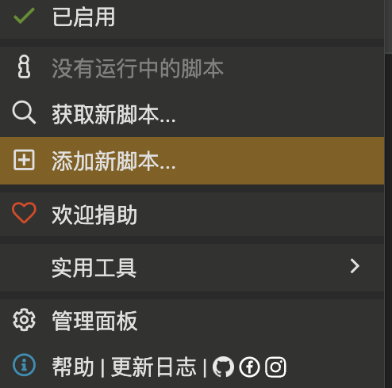
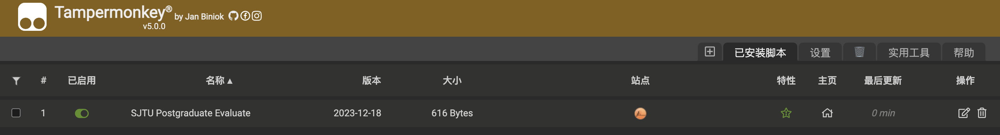

# 朴实无华的评教脚本

评教实在是太无趣了，需要点一堆 radio button，遂写了这个小脚本。

# 使用方法
+ 添加 chrome 油猴脚本，然后复制 script.js 的代码并保存。
    

    

+ 或者直接安装：https://greasyfork.org/zh-CN/scripts/482523-sjtu-postgraduate-evaluate

# 效果
帮你点掉这些无聊的 radio button。。。
